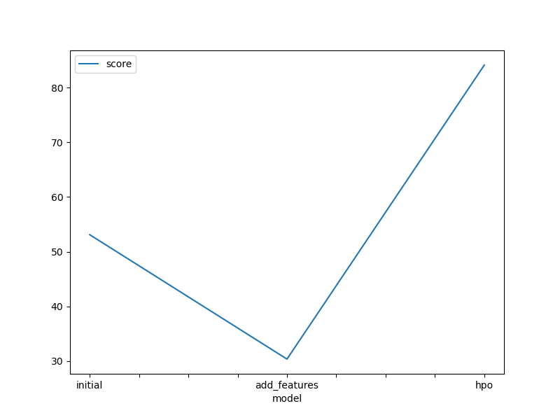
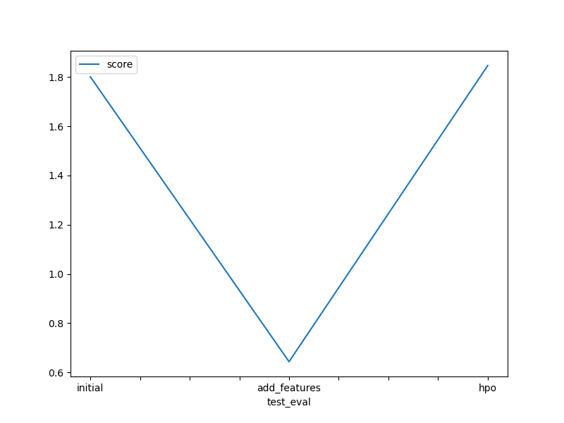

# Report: Predict Bike Sharing Demand with AutoGluon Solution
#### rey-dal

## Initial Training
### What did you realize when you tried to submit your predictions? What changes were needed to the output of the predictor to submit your results?
I parsed dataset wrong so it didn't let me submit my before fixing it.

### What was the top ranked model that performed?
WeightedEnsemble_L3 achieved the best performance by combining predictions from all base models with optimized weights. It assigns higher weights to better-performing models and lower weights to weaker ones, effectively leveraging the strengths of each model. This ensemble approach minimizes prediction errors and provides more stable results than any single model alone.

## Exploratory data analysis and feature creation
### What did the exploratory analysis find and how did you add additional features?
The exploratory analysis revealed that time patterns are crucial for bike rentals. By adding the 'hour' column and converting 'season' to categorical variables, we helped the model better understand daily and seasonal rental patterns.

### How much better did your model preform after adding additional features and why do you think that is?
The initial RMSE score of 1.80094 dropped to 0.64353, representing a 64.27% reduction in prediction error. This substantial improvement demonstrates the effectiveness of our feature engineering efforts in enhancing the model's predictive accuracy. Adding more informative features to the dataset enabled the model to utilize these features to make better predictions.

## Hyper parameter tuning
### How much better did your model preform after trying different hyper parameters?
While feature engineering improved both training (53.10 to 30.34) and test scores (1.80 to 0.64), hyperparameter optimization actually worsened performance (training: 84.12, test: 1.84). This suggests that our HPO made the model too complex, fitting noise in the training data rather than learning true patterns. We should consider reverting to the simpler feature-engineered model or adjusting our HPO strategy with stronger regularization.

### If you were given more time with this dataset, where do you think you would spend more time?
I would experiment with different hyperparameters because each parameter combination could potentially improve model performance. Testing various settings for stack levels, bag folds, trials, and search strategies might reveal a more optimal configuration.

### Create a table with the models you ran, the hyperparameters modified, and the kaggle score.

Model	        Hyperparameters 	                       Kaggle Score
Initial	        -Default settings                           1.80094
                -No feature engineering

Features	    - Added 'hour' column
                - Converted 'season' to categorical	        0.64353

HPO	            - num_stack_levels=3                        1.84672
                - num_bag_folds=5
                - num_bag_sets=3
                - num_trials=5
                - searcher='random'
                - dynamic_stacking=False

### Create a line plot showing the top model score for the three (or more) training runs during the project.

### Create a line plot showing the top kaggle score for the three (or more) prediction submissions during the project.

## Summary

Feature engineering significantly improved model performance. AutoGluon provided an efficient starting point, allowing more focus on feature optimization and hyperparameter tuning. The combination of AutoGluon's automated capabilities, strategic feature engineering, and optimized hyperparameters created a robust solution that can be applied to similar prediction problems.
